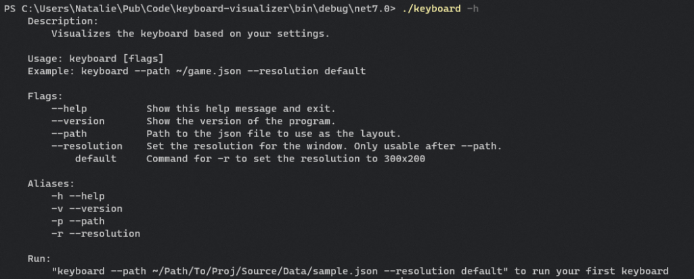

# Before you install

This project was made for linux only, as windows has nohboard.
So don't bother if you use windows, nohboard is a million times better.

You must use json to make your layout.

## Usage



## See:
[Key Names](https://github.com/omoNattie/keyboard-visualizer/blob/master/Source/Data/U_KEYS.md)

[A Json Sample](https://github.com/omoNattie/keyboard-visualizer/blob/master/Source/Data/sample.json)

### Compile it yourself:

### This app uses  dotnet 7.0, if you can only run 6.0 please add --self-contained true to the publish.

```git
git clone https://github.com/omoNattie/keyboard-visualizer
```

```bash
cd keyboard-visualizer

# if dotnet 7
dotnet publish --output ./release
# if dotnet 6
# keep in mind this will take much longer
dotnet publish --output ./release -p:PublishSingleFile=true --self-contained true

cd release

./keyboard --help
```

#### Moving to PATH
To run this program anywhere on your pc you must add it to your PATH!

```bash
# release

mkdir ~/keyboard
sudo mv ./* ~/keyboard
```

#### For fish shell

```bash
# ~/.config/fish/fish.config

fish_add_path $HOME/keyboard
```

#### For bash

```bash
# ./bashrc

export PATH=$PATH:$HOME/keyboard
```
